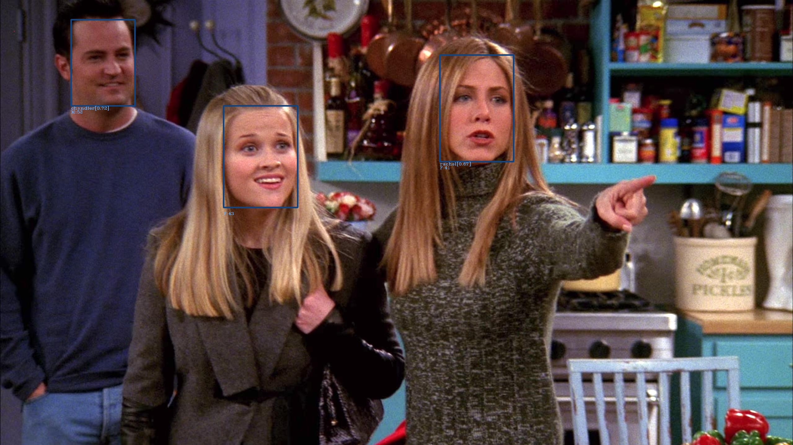

# insightface_facerecognition
Facial Recognition using Insightface API and models

## Usage Example
python3 face_recognition.py --task='inference image' --target=./friends1.jpg 

## Sample Output

## Requirements
- Insightface
- OnnxRuntime
- opencv
- numpy
